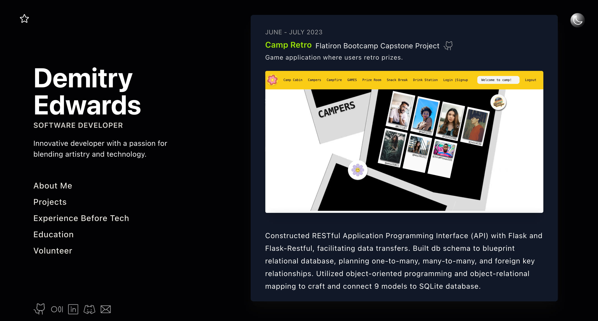

# Developer Portfolio



## Table of Contents

- [Overview](#overview)
- [Tech Stack](#tech-stack)
- [Features](#features)
- [Getting Started](#-getting-started)

## Overview

Welcome to my web developer <a href="https://demitry-edwards.vercel.app/" target="_blank"> portfolio</a>. This is a responsive web application that showcases my personal projects, previous work, and volunteer experience. Built with modern web technologies, this portfolio highlights my technical and design skills through an interactive user interface.

## Tech Stack

- **TypeScript**
- **JavaScript**
- **React**
- **Supabase**
- **Tailwind CSS**

## Features

- 🎥 **Video Project Showcase** – Interactive previews of projects in action.
- 🌓 **Light / Dark Mode Toggle** – Seamless theme switcher for user preference.
- 📱 **Responsive Layout** – Optimized for mobile, tablet, and desktop viewing.
- 🧩 **Modular Components** – Clean, scalable React components for easy updates.

## 🚀 Getting Started

To run the project locally:

```bash
# Clone the repository
git clone https://github.com/<your-username>/revamped.git

# Navigate to the project directory
cd revamped

# Install dependencies
yarn install

# Start the development server
yarn dev
```
